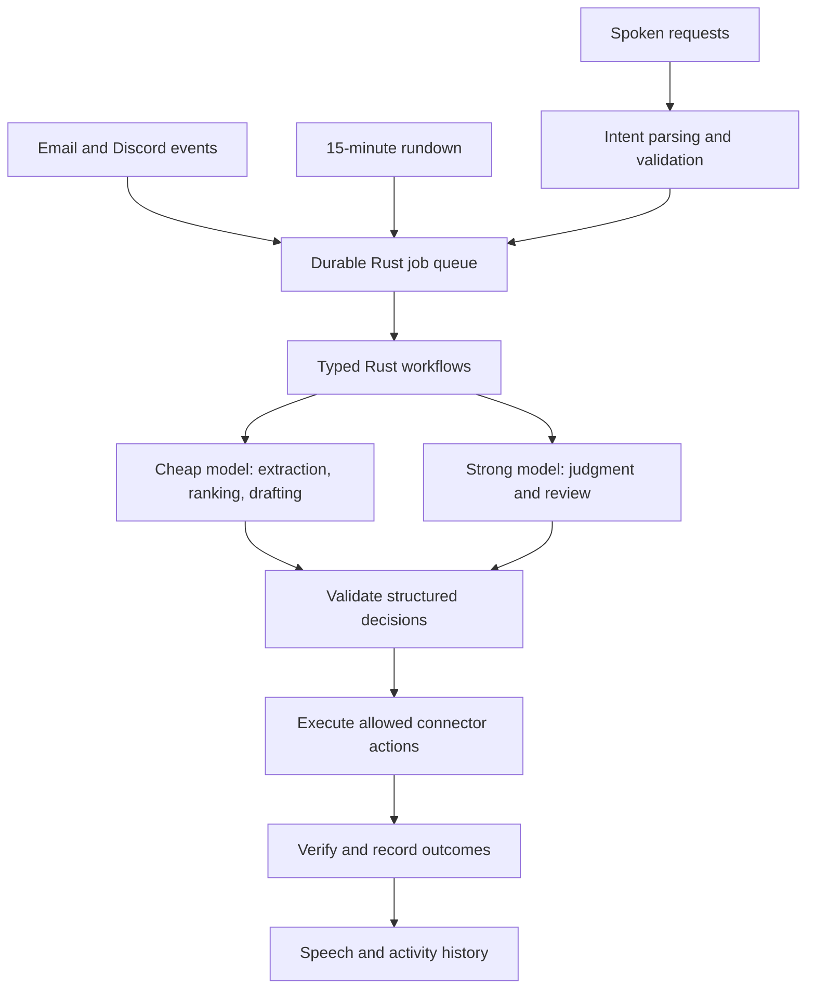

# Persistent voice agent

This document describes the product architecture. The resident implementation now lives in `src/agent/`; the CLI remains its control and diagnostic interface. See [the operating guide](running-the-agent.md) for configuration and exact behavior.

The five milestones below are implemented as bounded workflows: durable scheduling, model-backed decisions, research and Maildir organization, away-mode Discord replies, and shared voice dispatch. Current boundaries are deliberate: email integration uses a locally synchronized Maildir rather than bundled OAuth/IMAP; Discord uses REST polling rather than Gateway events; speech uses external adapters, with a bundled Linux/whisper.cpp wrapper; the wake phrase is checked after transcription. Dynamic model-generated workflows, semantic long-term memory, a dedicated acoustic wake detector, and native Windows background control remain extensions.

## Product behavior

Lion runs on the user's PC, keeps durable task state, and acts within standing preferences. Voice is the common interface across research, email and Discord. The user can ask what happened, change priorities, pause activity, or request a task by speaking. Completed work and urgent findings produce short spoken announcements, with details available in an activity history.

Examples of the intended experience:

- “I found a new electric propulsion paper that matches your interests. Shall I summarize it?”
- “An important email arrived. It needs your attention today.”
- “I answered a question in the aerospace channel and identified myself as your AI assistant.”
- “Pause Discord replies until tomorrow, but keep watching for important email.”

These announcements follow verified outcomes. Finding a candidate is different from deciding it is relevant; drafting a reply is different from sending it successfully.

## Execution model

A resident Rust process coordinates connectors, a durable job queue, bounded model calls, typed actions and speech. Models receive the context for a particular workflow step. Rust owns scheduling, parsing, pagination, retries, state transitions, permissions and outcome checks.

The default rundown interval is 15 minutes. Each rundown considers due research searches, inbox reconciliation, unresolved jobs, and a digest of recent activity. It should skip unchanged inputs and work that is not due. It is not a recurring invitation for a model to invent arbitrary tasks.

Incoming email and Discord questions also enqueue work as events arrive, or through bounded polling where a connector lacks events. This avoids making a direct question or urgent message wait for the research schedule. Quiet hours, user presence and interruption preferences affect speech and away-mode replies. The periodic rundown catches events missed while offline.

Only one job for a given source item and workflow revision should be active at a time. A job records its source cursor, attempts, next retry time, model usage, decision, proposed action and verified result. Restart recovery resumes pending work without replaying confirmed actions. Missed timers coalesce into one reconciliation instead of creating an unbounded backlog.

## Model allocation

Complex tasks become manageable for cheaper models by splitting them into small steps with explicit inputs, schemas and checks. Strong-model decisions can establish a reusable organization policy; cheap models apply it to routine cases. Cached decisions are invalidated when the source or policy changes.

| Step | Default responsibility | Escalation |
| --- | --- | --- |
| Fetch, MIME parsing, deduplication, labels, persistence | Rust | Report connector failures without asking a model to fix transport |
| Extract facts and rank research candidates | Cheap model | Conflicting evidence or difficult technical comparison |
| Draft summaries and factual Discord answers | Cheap model | Missing context, multi-step reasoning or consequential claims |
| Establish email organization policy | Strong model with user preferences | Ask the user only for preferences that cannot be inferred |
| Apply established email policy | Cheap model with validated output | Ambiguity, policy conflicts, unfamiliar categories or important disposition decisions go to the strong model |
| Validate and execute an action | Rust | Invalid or unsupported proposals become reviewable failures |

Routing uses workflow requirements and validation results, not just words such as “compare” in the prompt. A model's self-reported confidence is one signal, not proof that a decision is correct. Strong-model review receives the original relevant evidence as well as the cheap model's proposal.

Use bounded escalation and retry counts. Budget calls and tokens per job and per persisted time window, including failed attempts; a process-lifetime counter cannot support a permanent agent. Reserve part of the budget for urgent email. Provider failures and exhausted budgets leave jobs pending or reviewable rather than silently treating a keyword fallback as a model-backed decision.

## Workflows

### Aerospace discovery

Maintain a user interest profile, watched sources and a reading history. Fetch feeds, research APIs and configured web pages with bounded HTTP retrieval. Extract article text and metadata, deduplicate by identifiers and canonical URLs, and use cheap models to rank candidates against the user's interests. Escalate technical synthesis when needed.

Save provenance, links, dates, relevance reasons and summaries with the reading list. Announce newly selected items, not every search result. Research cadence can be longer than the rundown interval. The existing arXiv/Crossref crawler and compressed store supply part of this workflow; general article extraction, personalized ranking and reading state remain to be built.

### Email organization

Read new messages and relevant thread context, then propose structured decisions containing category, importance, action, evidence and policy version. Use strong-model judgment to establish the taxonomy and review ambiguous or important decisions. Cheap execution steps can apply that policy without replacing it with keyword matching.

Apply permitted provider labels or folder changes, retain previous state for undo, and verify the result. Persist the explanation so “Why did you move this?” can be answered. Announce important arrivals according to the user's privacy and interruption preferences. Current keyword tiers can serve as urgency signals during triage; they are not the finished organizer.

### Discord while away

Use a bot identity, configured channels, an explicit away mode and standing reply rules. Observe new messages and reply only to eligible questions, such as mentions or approved thread triggers. Ignore the bot's own messages and avoid bot-to-bot reply loops. Retrieve bounded thread context and only the user context permitted for that channel.

Draft with a cheap model, escalate difficult answers, and validate the proposed destination and content. Every outgoing reply must explicitly identify the assistant, for example: “I'm Leo's AI assistant, replying while he's away.” Enforce this disclosure in the sending code. The assistant must not invent the user's views, availability or commitments; questions needing those remain pending for the user.

Record the triggering message ID and outgoing message ID. If a send times out after possibly succeeding, reconcile before retrying so the agent does not double-post. Announce a reply only after its delivery is confirmed. Live account actions are controlled by the configured standing policy; development tests use mock services.

### Voice across all workflows

Connect microphone capture, optional wake-word detection, transcription, typed intent dispatch and speech playback to the resident process. Spoken requests use the same jobs and preferences as scheduled work. Support follow-ups such as “read it,” “why is it important?” and “undo that” using explicit recent-event context.

Keep speech off the job execution path: a playback failure must not cause an email move or Discord reply to run again. Queue and coalesce announcements, prioritize urgent events, respect quiet hours, and allow interruption. Pause microphone interpretation during playback or otherwise prevent the agent from treating its own speech as a command. A spoken pause or status request should stay responsive during a long research job.

## Implementation sequence and acceptance criteria

1. **Resident runtime:** add a daemon command, persisted jobs and source cursors, a configurable 900-second rundown, graceful shutdown and durable budgets. Verify restart recovery, duplicate suppression, timer coalescing and failure isolation with fake connectors and a controllable clock.
2. **Model-backed decisions:** introduce typed workflow proposals, schema validation, policy versions and bounded escalation. Verify ambiguous email cases reach the strong model and invalid outputs cannot mutate a mailbox. Retain the CLI as a way to inspect and replay individual steps.
3. **Research and email connectors:** add personalized article discovery and actual mailbox label/folder application with undo. Verify repeated retrieval does not repeat announcements, action failures remain pending, and organization explanations retain their evidence.
4. **Away-mode Discord:** add event ingestion, trigger rules, disclosure-enforcing replies and delivery reconciliation. Verify no reply while away mode is off, no duplicate sends after restart, and no claims of delivery before confirmation.
5. **Unified voice:** wire announcement events into speech from the first runtime milestone, then add microphone intents, contextual follow-ups and interruption. Verify a voice request can start a workflow and its result can be heard without blocking unrelated work.

Account-specific configuration will supply mailbox provider credentials, Discord channels and permitted reply scope, research interests, voice adapters, and quiet hours. These are deployment settings; they should not be hard-coded into the framework.

## Reuse and changes needed

Keep the existing HTTP bounds, storage limits, research parsers, provider adapters and voice subprocess controls. Extend the controller into typed workflows. Replace the process-only model budget and keyword-only decision routing for resident operation. Introduce durable mutable job state alongside the existing immutable content objects. The current Maildir watcher and Discord summary command remain useful diagnostic entry points while connectors gain event ingestion and verified actions.

The architecture succeeds when the PC can remain running unattended, complete a configured research/email/Discord workflow, recover cleanly after restart, and explain verified activity through voice while staying within its configured budget.
